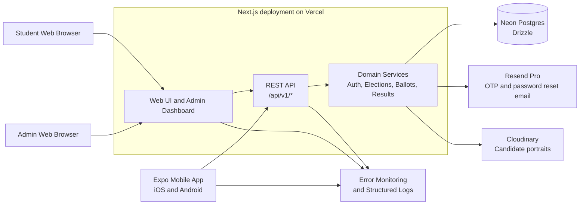
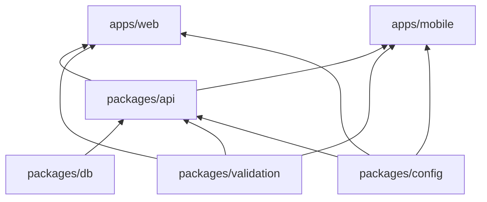
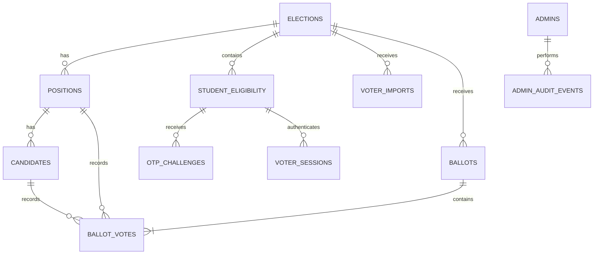
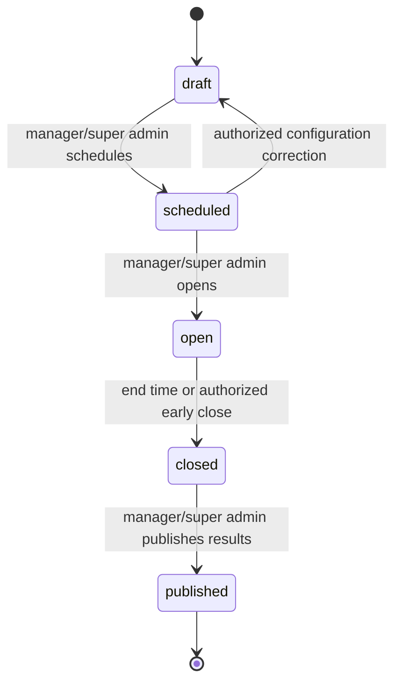
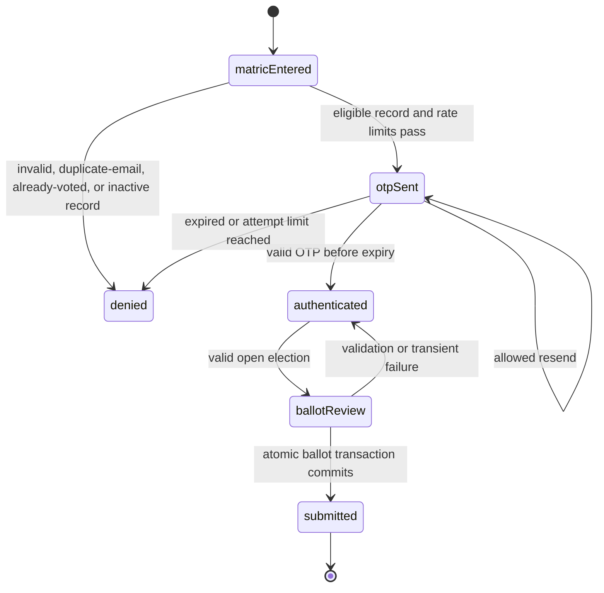

# Department Election Platform - Architecture

## 1. Purpose and scope

This document defines the implementation architecture for the department election platform. It supports one department election at a time, up to 5,000 eligible students, secret ballots, web and native mobile voting, and role-based election administration.

The platform is a TypeScript monorepo managed with pnpm workspaces. It contains a Next.js 16.3.3 application as both the web client and the only backend, plus an Expo SDK 57 mobile application that calls the backend over HTTPS.

### Architectural principles

- The server is the authority for identity, eligibility, election state, authorization, and vote submission.
- A voter identity must never be stored with ballot selections or exposed through APIs, audit logs, or exports.
- Every state-changing request is authenticated, authorized, validated, audited where relevant, and safe to retry.
- Web and mobile use the same versioned API contract for all operations that mobile can perform.
- Production, staging, and local environments are isolated. Staging contains synthetic data only.

## 2. System overview



The Next.js deployment owns all trusted server work. The Expo client is untrusted and receives only public configuration plus a runtime API base URL. It never connects to Neon, Resend, Cloudinary signing endpoints, or administrative infrastructure directly.

## 3. Repository and dependency boundaries

```text
.
├── apps/
│   ├── web/                 # Next.js App Router: web UI, admin UI, REST route handlers
│   └── mobile/              # Expo SDK 57: student app and results-only admin screens
├── packages/
│   ├── api/                 # Contracts, schemas, domain services, authorization policies
│   ├── db/                  # Drizzle schema, migrations, repositories, transactions, fixtures
│   ├── validation/          # Shared Zod schemas and input/output types
│   ├── config/              # Typed non-secret client/server configuration helpers
│   └── ui/                  # Design tokens and platform-neutral UI primitives only
├── docs/
└── .github/workflows/
```

### Dependency direction



- `packages/db` may depend only on database libraries and shared types; it must not import application or UI code.
- `packages/api` implements domain services and can depend on `db`, `validation`, and `config`; it must not depend on Next.js or Expo UI code.
- `apps/web` adapts HTTP requests to API/domain services and renders web/admin interfaces.
- `apps/mobile` calls public API contracts and renders native interfaces. It cannot import server-only code, database code, or secrets.
- Shared `ui` code is limited to tokens and platform-neutral assets. Do not force web and native components into one component abstraction where their accessibility or interaction behavior differs.

## 4. Runtime topology

### Web and API

`apps/web` is deployed to Vercel. It serves:

- public student web routes;
- role-protected administrator dashboard routes;
- versioned REST route handlers at `/api/v1/*`;
- server-rendered read paths when they improve web performance.

The production web origin and mobile API base URL are environment-configured. Until a final domain is selected, do not hard-code hostnames. Mobile uses `EXPO_PUBLIC_API_BASE_URL`; web uses same-origin requests where possible.

### Mobile

The Expo application is distributed through Google Play and Apple App Store. It contains student login, OTP verification, ballot review/submission, receipt, and published-results screens. An authenticated administrator may view final/published results on mobile but cannot perform administrative changes there.

Store no secrets in the application bundle. Store the opaque mobile session token only in platform secure storage; never use AsyncStorage for credentials.

### External services

| Service          | Responsibility                                          | Trust boundary                                         |
| ---------------- | ------------------------------------------------------- | ------------------------------------------------------ |
| Vercel           | Runs Next.js UI and route handlers                      | Server environment variables only                      |
| Neon Postgres    | System of record, transactions, rate limits, audit data | Server-side database connection only                   |
| Drizzle          | Typed SQL schema, migrations, repositories              | Server/build tooling only                              |
| Resend Pro       | OTP and admin password-reset delivery                   | Server API key only                                    |
| Cloudinary       | Candidate portrait storage and delivery                 | Server creates restricted signed upload parameters     |
| Error monitoring | Redacted errors, traces, operational alerts             | Client DSN may be public; server token remains private |

Resend Pro is mandatory for the expected election scale: Resend's free plan is currently restricted to 100 transactional emails daily and 3,000 monthly, which is insufficient for a 5,000-student OTP election. [Resend pricing](https://resend.com/pricing?product=marketing)

## 5. Domain model and secret-ballot boundary

All time values are stored as UTC timestamps. The configured election timezone is used only for display and election schedule interpretation.



### Identity and administration tables

- `admins`: id, username, email, password hash, role (`super_admin`, `manager`, `observer`), force-password-change flag, active flag, timestamps.
- `admin_password_reset_tokens`: hashed reset token, admin id, expiry, consumed timestamp.
- `admin_sessions`: hashed opaque token, admin id, expiration and revocation timestamps.
- `admin_audit_events`: actor admin id, action, target type/id, safe metadata, required reason where applicable, timestamp. Log IP/device metadata only after it is included in the privacy notice.

### Election and eligibility tables

- `elections`: id, department name, title, timezone, start/end timestamps, state, closed/published timestamps, creation/update metadata.
- `positions`: election id, name, display order.
- `candidates`: position id, full name, short manifesto, Cloudinary public ID and delivery URL, display order, active flag.
- `voter_imports`: election id, uploader id, filename, checksum, validation summary, accepted/rejected row counts, timestamps, status.
- `student_eligibility`: election id, normalized matric number, full name, normalized school email, level, import id, status, voted timestamp. Enforce unique `(election_id, matric_number)`.
- `otp_challenges`: eligibility id, hashed OTP, sent/expiry timestamps, failed attempt count, verified/consumed timestamps.
- `auth_rate_limits`: scope type/key, action, count, rolling-window start, cooldown expiry.
- `voter_sessions`: hashed opaque session token, eligibility id, expiry and revocation timestamps.

### Anonymous ballot tables

- `ballots`: opaque anonymous id, election id, submitted timestamp, hashed receipt token. It has no student, eligibility, session, email, or matric-number foreign key.
- `ballot_votes`: ballot id, position id, candidate id. Enforce unique `(ballot_id, position_id)` and ensure the candidate belongs to the selected position/election.

The application must not add a convenience join, view, telemetry field, audit payload, or export that links `student_eligibility`/`voter_sessions` to `ballots`/`ballot_votes`.

## 6. Election and authentication state machines

### Election lifecycle



- Only one election may be `open` at any time.
- Opening locks positions, candidates, and voter eligibility. No edits to these resources are permitted until the election is closed.
- A close action before the configured end time requires an explicit reason and audit event.
- Closing does not automatically publish results. Publishing is a distinct audited action.
- Reopening a closed/published election is not supported in v1. Department staff handle disputes outside the application.

### Student authentication and voting



An OTP is six digits, expires after 10 minutes, and accepts at most five verification attempts. A voter session expires after 24 hours or at election close, whichever occurs first.

## 7. API design

### General contract

- Base path: `/api/v1`.
- JSON request/response bodies use UTF-8 and shared Zod schemas.
- Validate every request at the route boundary before calling a domain service.
- Use standard status codes: `200/201/204`, `400`, `401`, `403`, `404`, `409`, `422`, `429`, and `500`.
- Return generic errors for eligibility and login checks so callers cannot enumerate valid matric numbers, student email addresses, or administrator accounts.
- Return errors using:

```json
{
  "error": {
    "code": "OTP_INVALID_OR_EXPIRED",
    "message": "The code is invalid or has expired. Request a new code to continue.",
    "requestId": "req_..."
  }
}
```

The `message` is safe for display. `code` is a stable client-handling value. Internal diagnostics remain in redacted server logs keyed by `requestId`.

### Idempotency

All externally retriable mutations accept an `Idempotency-Key` UUID header. The server stores the request hash, actor/session scope, response status/body, and expiry for the operation. Repeating an identical request returns the original response; reusing a key with a different payload returns `409`.

Apply idempotency to OTP send/resend, CSV commit, signed upload request, ballot submission, election open/close, results publication, and export generation.

### Endpoint groups

| Group                  | Examples                                                                               | Authorization                                                     |
| ---------------------- | -------------------------------------------------------------------------------------- | ----------------------------------------------------------------- |
| Student authentication | `POST /student/auth/start`, `POST /student/auth/verify`, `POST /student/auth/sign-out` | Public for start/verify; voter session for sign-out               |
| Student election       | `GET /student/election`, `POST /student/ballots`, `GET /student/results`               | Valid voter session; results only after publication               |
| Admin auth             | `POST /admin/auth/sign-in`, password-change/reset endpoints, sign-out                  | Public where needed; admin session otherwise                      |
| Admin accounts         | list/create/deactivate/reset/role update                                               | Super admin only                                                  |
| Election setup         | election CRUD, positions/candidates, CSV validation/commit, portrait signing           | Manager or super admin; only before open                          |
| Election control       | preview, schedule, open, close, publish                                                | Manager or super admin; audited                                   |
| Reporting              | results, export, audit report                                                          | Observer/manager/super admin after close; exports per role policy |

### Authorization matrix

| Capability                          | Student | Observer | Manager | Super admin |
| ----------------------------------- | ------- | -------- | ------- | ----------- |
| Authenticate and vote               | Yes     | No       | No      | No          |
| View published student results      | Yes     | No       | No      | No          |
| View closed results                 | No      | Yes      | Yes     | Yes         |
| Configure/import/open/close/publish | No      | No       | Yes     | Yes         |
| Export final reports                | No      | Yes      | Yes     | Yes         |
| Manage admin accounts               | No      | No       | No      | Yes         |

## 8. Authentication, sessions, and transport security

### Student sessions

1. A public request submits a matric number.
2. The API finds the eligibility record, checks election state, email integrity, already-voted status, and Neon-backed rate limits.
3. The API creates a hashed OTP challenge and sends the plaintext OTP only to the stored school email through Resend.
4. Successful OTP verification consumes the challenge and creates a hashed opaque voter-session token.
5. Web sets the opaque token in a `Secure`, `HttpOnly`, `SameSite=Lax` cookie. Mobile receives the token only over TLS and stores it in secure device storage.

### Admin sessions

- Passwords use Argon2id with current recommended parameters.
- Admin accounts are individually named; shared credentials are forbidden.
- The first successful sign-in with a temporary password must force password change before other admin API access.
- Password-reset tokens are high-entropy, opaque, hashed at rest, single-use, and short-lived.
- Admin sessions use the same opaque-token model with shorter configurable expirations and server-side revocation.

### HTTP protections

- Enforce HTTPS in every non-local environment.
- Verify request origin and anti-CSRF token on cookie-authenticated web mutations.
- Configure CORS only for explicitly configured mobile/web origins; do not use wildcard origins with authenticated endpoints.
- Set content-security policy, security headers, request body limits, and strict upload content-type/size checks.
- Never emit passwords, OTPs, reset/session tokens, raw authorization headers, or ballot choices into logs, analytics, or error-monitoring context.

## 9. Ballot transaction and results calculation

### Atomic ballot submission

The ballot endpoint accepts one candidate selection for every position in the open election. It performs the following in a serializable Neon transaction:

1. Validate the voter session and derive the eligible election.
2. Lock the eligibility row with `SELECT ... FOR UPDATE`.
3. Confirm the election is open, the session is unexpired, and `voted_at` is null.
4. Validate every selected candidate belongs to a unique position in that election and every position is represented exactly once.
5. Insert an anonymous `ballots` row and its `ballot_votes` rows.
6. Set `student_eligibility.voted_at` and update its status.
7. Commit; on serialization failure, retry a bounded number of times on the server before returning a safe retry response.

The unique eligibility constraint and locked eligibility row guarantee that concurrent submissions for a matric number produce exactly one committed ballot. The confirmation receipt is generated from a random token stored only as a hash and cannot reveal vote selections.

### Results

- Results queries aggregate `ballot_votes` by position and candidate only.
- Before `closed`, all result endpoints return `403`, including to administrators.
- After `closed` but before `published`, only authorized administrators may view final totals.
- After `published`, student results display candidates, totals, winners, and ties.
- The highest total wins. Equal highest totals are emitted as `tie` and require departmental resolution outside the platform.

## 10. CSV import and media upload workflows

### Student registry CSV

CSV headers are exactly `matric_number`, `full_name`, `school_email`, and `level`.

1. A manager uploads a CSV to a draft or scheduled election.
2. The API normalizes whitespace/casing, validates headers and required fields, validates email format, and detects duplicate matric numbers/emails in the file and in the election.
3. The dashboard shows accepted rows and row-level validation failures.
4. A manager explicitly commits the reviewed batch using an idempotency key.
5. The server stores the import summary/checksum and writes an audit event.
6. Import replacement is permitted only before opening; opening locks the eligibility list.

### Candidate portraits

1. A manager requests short-lived, constrained Cloudinary upload parameters from the API.
2. The server authorizes the manager, validates draft/scheduled election state, restricts the preset/folder/type/size/dimensions, and returns a signed upload payload.
3. The browser uploads directly to Cloudinary.
4. The manager submits the resulting public ID to the API; the server verifies it matches the assigned folder/preset before saving it to `candidates`.

Do not accept unrestricted client-provided URLs or permanent Cloudinary credentials.

## 11. Manual v1 operational runbooks

Automated scheduled jobs are deferred to v2. Managers and the super admin must complete these actions through protected dashboard commands, each requiring confirmation and audit logging.

| Procedure           | Responsible role       | Required action                                                                                                                                 |
| ------------------- | ---------------------- | ----------------------------------------------------------------------------------------------------------------------------------------------- |
| Open election       | Manager or super admin | Confirm final configuration, lock registry/ballot, transition to `open`, verify status page                                                     |
| Close election      | Manager or super admin | Close at scheduled time or enter an early-close reason, verify no further submissions are accepted                                              |
| Publish results     | Manager or super admin | Review aggregate totals/turnout/ties, confirm publication, then expose student results                                                          |
| Retention purge     | Super admin            | Review one-year eligibility/OTP/session/audit retention report, run purge, download non-sensitive completion record                             |
| Failed OTP delivery | Manager or super admin | Inspect redacted delivery metrics, verify sender/domain status, direct student to official support, correct registry only before election opens |
| Tie                 | Manager or super admin | Export final totals/audit report, mark departmental resolution externally; do not alter ballot data                                             |
| Quota monitoring    | Super admin            | Check Resend, Vercel, Neon, Cloudinary, and monitoring quotas before and during election operations; escalate before a limit is reached         |

## 12. Environment configuration and secrets

Use `.env.local` locally and environment-specific secrets in Vercel/EAS. Commit only `.env.example` with names and non-sensitive placeholders.

| Variable group                         | Owner             | Available to                                      |
| -------------------------------------- | ----------------- | ------------------------------------------------- |
| `DATABASE_URL`, Drizzle migration URL  | Neon              | Web server and migration tooling only             |
| `RESEND_API_KEY`, sender address       | Resend            | Web server only                                   |
| Cloudinary API secret                  | Cloudinary        | Web server only                                   |
| Cloudinary cloud name/public key       | Cloudinary        | Web server; public identifier only where required |
| Cookie/session/CSRF encryption secrets | Application       | Web server only                                   |
| Error-monitoring auth token            | Monitoring vendor | Web server/CI only                                |
| Public monitoring DSN                  | Monitoring vendor | Web and mobile only                               |
| `EXPO_PUBLIC_API_BASE_URL`             | Application       | Mobile bundle; must contain only HTTPS URL        |
| Allowed origins/app identifiers        | Application       | Web server and build configuration                |

Rotate production secrets after a suspected leak, administrator departure, or provider-account transfer. Never use production secrets in staging or local development.

## 13. Observability and privacy

Capture:

- server/client crashes and request failures;
- OTP sends, deliveries/failures where available, verification success/failure, and rate-limit events;
- voter funnel counters without recording identity with selection data;
- ballot transaction failures, conflicts, and latency;
- election transitions, imports, exports, account actions, and result publication;
- provider quota warnings and database/API availability.

Structured logs use request IDs and redact sensitive fields. Monitoring alert thresholds must include OTP delivery failures, unusual verification failure rates, ballot-submit error spikes, database/API failure, and approaching provider limits.

Retain student identity, OTP/security records, and required audit records for one year. After that period, purge or anonymize personal data while retaining aggregate anonymous results and non-identifying operational summaries.

## 14. Testing and validation strategy

### Automated tests

- Unit: election transitions, authorization matrix, CSV normalization, OTP expiry/attempts, rate limits, session expiry, result/tie logic, and retention rules.
- Integration: Drizzle migrations, imports, session persistence, authorization, locked-election writes, atomic ballot transaction rollback, concurrent one-vote enforcement, and privacy-safe result/export queries.
- End-to-end: web and Expo student OTP-to-vote journeys; expired OTP, invalid eligibility, already-voted, slow/failing submission, closed election, results publication; admin setup and role restrictions.
- Security: CSRF/CORS, unauthorized resource access, privilege escalation, malformed/crafted ballot payloads, repeated OTP/admin-login attempts, insecure upload attempts, and sensitive-data log redaction.

### Operational validation

Before production, run a timed staging mock election with synthetic data and election staff. Rehearse import, candidate setup, web/Android/iOS voting, delayed OTP support, close, publish, export, tie handling, and early-close procedures. Run a representative load test for the expected 5,000-student OTP/voting surge and verify provider quotas, latency, and error alerts.

## 15. Architecture acceptance criteria

- Both web and mobile call the same protected versioned API for shared student workflows.
- No client can directly access Neon, Resend secrets, Cloudinary signing secrets, or administrative services.
- One eligible matric number produces at most one committed ballot, even under concurrent requests.
- No supported query, export, log, audit event, or UI joins a voter identity to a ballot selection.
- Admins cannot view results while the election is open; student results remain unavailable until explicitly published.
- Opening an election prevents edits to the registry, positions, and candidates.
- Staging is isolated from production and contains no production student data.
- All manual v1 operations have protected dashboard actions and immutable audit evidence.
